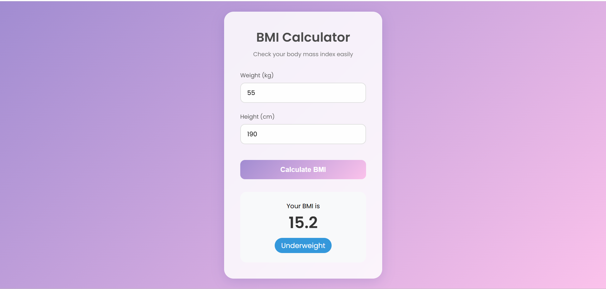

# BMI-Calculator

A simple web application that calculates Body Mass Index (BMI) based on a user's height and weight.

## ✨ Features

- Input weight (kg)
- Input height (cm)
- Calculate BMI instantly
- Display BMI result
- Show BMI status (Underweight, Normal, Overweight, Obese)
- Clean and responsive UI

## 🛠️ Technologies Used

- HTML5
- CSS3
- JavaScript

## 📸 Screenshot

## 📚 What I Learned

- Form Input Handling
- Mathematical Operations in JavaScript
- Conditional Logic
- DOM Manipulation
- Event Handling

## 🎯 Purpose of Project

This project was created to practice JavaScript fundamentals by building a useful health-related calculator.

## 👩‍💻 Author

Nikita
